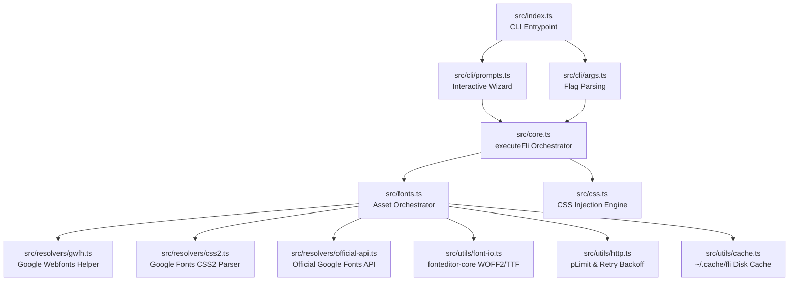

# `@dstn/fli` — Technical Documentation & Reference Manual

Welcome to the comprehensive technical documentation for `@dstn/fli` (v2.0.0). This document covers our modular architecture, font resolution fallback strategies, atomic filesystem operations, programmatic API, and troubleshooting guidelines.

---

## Table of Contents
1. [Architecture Overview](#1-architecture-overview)
2. [Hybrid Font Resolution Chain](#2-hybrid-font-resolution-chain)
3. [Format Derivation Engine](#3-format-derivation-engine)
4. [Atomic I/O & Rollback Guarantee](#4-atomic-io--rollback-guarantee)
5. [Programmatic API Reference (`executeFli`)](#5-programmatic-api-reference-executefli)
6. [Troubleshooting & FAQ](#6-troubleshooting--faq)

---

## 1. Architecture Overview

`@dstn/fli` is engineered around the **Single Responsibility Principle (SRP)**. Business logic is strictly decoupled from interactive CLI prompts and process lifecycle controls.



### Module Directory Breakdown

- **`src/cli/`**: Interactive `@clack/prompts` wizard and argument parser (`node:util parseArgs`).
- **`src/core.ts`**: Pure orchestration layer (`executeFli`). Handles automatic backup creation and rollback recovery.
- **`src/resolvers/`**: Pluggable font metadata resolvers.
- **`src/utils/`**: Shared utilities for network retries, concurrency limiting, disk caching, font magic-byte checking, and CSS inspection.

---

## 2. Hybrid Font Resolution Chain

To ensure high availability and prevent build-time failures, `fli` resolves font metadata through a **3-tier hybrid fallback chain**:

```
           ┌──────────────────────────────────────────────┐
           │     1. Google Webfonts Helper (gwfh)         │
           └──────────────────────┬───────────────────────┘
                                  │ (on failure)
                                  ▼
           ┌──────────────────────────────────────────────┐
           │     2. Google Fonts CSS2 Parser              │
           └──────────────────────┬───────────────────────┘
                                  │ (on failure & API key set)
                                  ▼
           ┌──────────────────────────────────────────────┐
           │     3. Official Google Fonts Webfonts API v1 │
           └──────────────────────────────────────────────┘
```

1. **Google Webfonts Helper (`gwfh.mranftl.com`)**: Provides direct binary URLs for all formats (`woff2`, `woff`, `ttf`, `eot`, `svg`) along with weight and style metadata. Responses are cached locally in `~/.cache/fli/` for 24 hours.
2. **Google Fonts CSS2 Parser (`fonts.googleapis.com/css2`)**: If the primary helper API is unreachable, `fli` sends a request with a modern User-Agent to Google's official CSS2 endpoint and parses `@font-face` URL declarations.
3. **Official Google Fonts Webfonts API v1**: If `GOOGLE_FONTS_API_KEY` is present in the environment, `fli` queries the official v1 API endpoint as a last-resort fallback.

---

## 3. Format Derivation Engine

When a requested format (such as legacy `woff`, `eot`, or `svg`) is not directly available from the upstream resolver, `fli` automatically fetches the base TrueType (`ttf`) font and converts it locally using **`fonteditor-core`**.

### Magic Byte Validation
Before converting or saving font files, `fli` validates file headers:
- **TrueType (`TTF`)**: Verifies `0x00010000` or `OTTO` (`0x4f54544f`) magic signatures.
- **WOFF2**: Verifies `wOF2` (`0x774f4632`) magic signature.

---

## 4. Atomic I/O & Rollback Guarantee

`fli` guarantees that your repository never ends up in a corrupted or half-injected state during automated runs.

### TOCTOU Prevention
When creating target CSS files (`ensureCssFile`), `fli` uses exclusive filesystem flags (`flag: 'wx'`) to prevent Time-of-Check to Time-of-Use race conditions across concurrent processes.

### Atomic File Writes
Font files and stylesheets are written to temporary files (`.tmp`) inside the destination folder and atomically renamed (`fs.promises.rename`) over the target file once write completion is verified.

### Automatic Rollback
Before modifying your CSS stylesheet, `executeFli` creates a snapshot backup (`.fli-backup`). If any font download fails or `@font-face` injection throws an error, the original stylesheet is automatically restored.

---

## 5. Programmatic API Reference (`executeFli`)

You can invoke `fli` programmatically in Node.js or build scripts without launching CLI prompts:

```typescript
import { executeFli, type FliOptions, type FliResult } from '@dstn/fli/core';

const options: FliOptions = {
  fonts: ['Inter', 'Roboto'],
  formats: ['woff2'],
  weights: [400, 700],
  frameworkKey: 'next',
  cssPath: '/path/to/project/src/app/globals.css',
  projectRoot: '/path/to/project',
  dryRun: false,
  verbose: true,
};

const result: FliResult = await executeFli(options);
console.log(`Saved ${result.filesWritten} files to ${result.outputDir}`);
```

### `FliResult` Schema
```typescript
interface FliResult {
  filesWritten: number;        // Number of font binaries written to disk
  outputDir: string;           // Absolute path to destination static folder
  injectedFamilies: string[];  // Families injected into CSS
  skippedFamilies: string[];   // Families skipped (already present in CSS)
  publicUrlBase: string;       // Public URL prefix used in CSS src URLs
}
```

---

## 6. Troubleshooting & FAQ

### Q: I am receiving `HTTP 429` rate limit errors during heavy builds.
`fli` automatically handles `HTTP 429` responses by inspecting `Retry-After` headers and applying exponential backoff across 3 retries. If rate limits persist, ensure parallel builds share the local cache directory (`~/.cache/fli/`).

### Q: How do I clear the local metadata cache?
You can clear cached API responses programmatically via `clearCache()`:
```typescript
import { clearCache } from '@dstn/fli';
await clearCache();
```

### Q: How do I specify a custom asset path for Vanilla projects?
Provide `--framework vanilla --css <path-to-css>` and `fli` will store assets under `public/fonts` and reference them as `/fonts/<filename>`.

---

## 7. CI/CD & NPM Automatic Publishing

The repository includes two specialized GitHub Actions workflows located in `.github/workflows/`:

1. **`ci.yml` (Continuous Integration)**
   - Runs on every push to `master` and pull request.
   - Executes TypeScript type checking (`npm run typecheck`), production bundling (`npm run build`), and the full Vitest suite (`npm test`).

2. **`release.yml` (Automated GitHub & NPM Trusted Publishing)**
   - Triggered via `workflow_dispatch` or git tag push (`v*`, `*.*.*`).
   - Runs clean verification (`npm ci && npm test`).
   - Extracts the latest version section from `CHANGELOG.md` to create a GitHub Release using the official `gh` CLI.
   - Uses **npm Trusted Publishing (OIDC)** (`id-token: write`) to publish `@dstn/fli` to the public npm registry with cryptographic provenance attestation (`npm publish --provenance --access public`), requiring zero static tokens or secrets.

